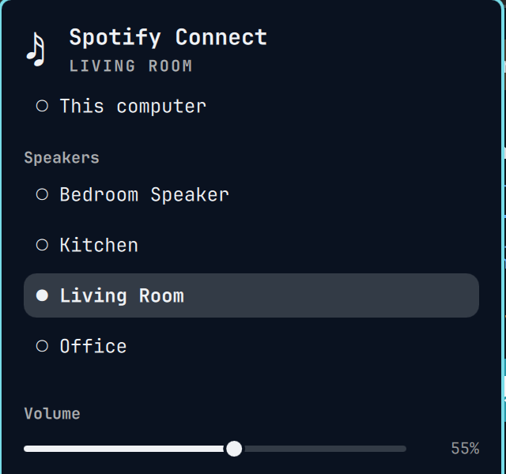

# Spotify Connect

Shows the active Spotify Connect device in the Omarchy bar and moves playback
between devices: Sonos, Echo, any other Connect target, and this computer.

It only picks the output. Use Spotify, Tuify or any other client to browse and
control playback.



## How it works

- **`spotify-connect daemon`** runs as a systemd user service. It is built on
  [librespot](https://github.com/librespot-org/librespot).
  - It registers this computer as a Connect receiver. Audio plays through
    PulseAudio, which on Omarchy is PipeWire.
  - It keeps the Connect device list from Spotify's live updates. That list
    includes devices that the public Web API leaves out, such as Sonos.
  - librespot does not expose the list it gets at startup. To fetch it, the
    daemon registers a second, hidden device once when it connects.
  - It serves that state on `$XDG_RUNTIME_DIR/spotify-connect.sock`.
- **`Panel.qml`** polls `spotify-connect devices --json` and runs
  `spotify-connect switch <id>` when you pick a device. It never talks to
  Spotify itself.

## Requirements

- Omarchy with the Quickshell-based Omarchy shell
- Rust (`cargo`), `libpulse` and `pipewire-pulse`
- A Spotify Premium account

## Install

1. Build and install the daemon:

   ```bash
   cargo install --locked --path daemon
   ```

   Keep `--locked`. `Cargo.lock` pins `vergen` 9.0.x, because librespot 0.8.0
   does not build with newer versions.

2. Enable the service:

   ```bash
   cp daemon/spotify-connect.service ~/.config/systemd/user/
   systemctl --user enable --now spotify-connect
   ```

3. Log in once. This opens a browser. If `~/.cargo/bin` is not on your
   `PATH`, use `~/.cargo/bin/spotify-connect login` instead:

   ```bash
   spotify-connect login
   ```

   Credentials are stored in `~/.local/state/spotify-connect/`, and the daemon
   picks them up within a few seconds.

4. Add the plugin:

   ```bash
   omarchy plugin add https://github.com/ciryon/omarchy-spotify-connect --enable
   ```

## Remove

```bash
omarchy plugin disable io.github.ciryon.spotify-output
omarchy plugin remove io.github.ciryon.spotify-output
systemctl --user disable --now spotify-connect
rm ~/.config/systemd/user/spotify-connect.service
cargo uninstall spotify-connect
rm -rf ~/.local/state/spotify-connect    # saved Spotify credentials
```

## CLI

```bash
spotify-connect status --json    # {"activeDevice":{"id":"…","name":"Portable"}}
spotify-connect devices --json   # [{"id":"…","name":"This computer","type":"local","active":false}, …]
spotify-connect switch <device-id>
```

| Exit code | Meaning |
|-----------|---------|
| 0 | OK |
| 2 | Daemon not running or not yet connected |
| 3 | Not logged in |

Logs: `journalctl --user -u spotify-connect -f`

## Usage

| Action | Result |
|--------|--------|
| Left click | Open or close the device list |
| Right click | Refresh now |
| `↑` / `↓` | Move through the list |
| `Enter` | Move playback to the selected device |
| `r` | Refresh |
| `Esc` | Close |

## Settings

| Setting | Default | Meaning |
|---------|---------|---------|
| `refreshIntervalSec` | 5 | How often the bar asks the local daemon for state, in seconds. It polls every second while the popup is open. |

## License

MIT — see [LICENSE](LICENSE).
